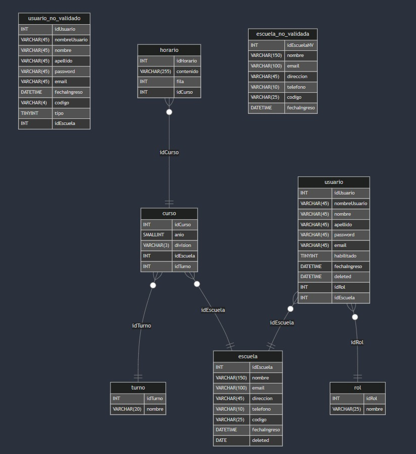

# Generación T – 2024
<h1 align="center">E.T. Nº12 D.E. 1º "Libertador Gral. José de San Martín"</h1>
<p align="center">
  
</p>

## DER


## Pre-requisitos 📋
- **Node.js** (versión 16 o superior)
- **npm** (gestor de paquetes de Node.js)
- **MySQL** (o MariaDB)
- **Vite** (para el desarrollo del frontend)

## Despliegue 📦
Configuración y despliegue del Frontend
- Instalar dependencias del frontend: En el directorio del frontend, asegúrate de que las dependencias estén instaladas. Para hacerlo, navega hasta el directorio frontend/ en la terminal y ejecuta:
```
npm install
```
Iniciar el servidor de desarrollo: 
- Una vez que las dependencias estén instaladas, inicia el servidor de desarrollo para trabajar localmente:
```
npm run dev
```
- Esto iniciará Vite y podrás acceder a la aplicación desde http://localhost:5173/. Si todo está bien configurado, el frontend debería funcionar correctamente en tu máquina local.

Configuración y despliegue del Backend
Instalar dependencias del backend: 
- Navega hasta el directorio backend/ y asegúrate de que las dependencias estén instaladas:
```
npm install
```
- Configurar la base de datos: Ya ejecutaste el script db.sql, lo que significa que tu base de datos está configurada. Asegúrate de que el servidor MySQL esté corriendo y accesible.
Para verificar la conexión con la base de datos, el servidor backend debería mostrar un mensaje como "Conexión exitosa con la base de datos" (lo que mencionaste que ya sucedió).

Iniciar el servidor de backend: 
- Para iniciar el backend en tu entorno local, ejecuta:
```
npm start
```
- Esto iniciará el servidor y, según el mensaje que compartiste, debería estar corriendo en http://localhost:6008.

Configuración de la base de datos
- Asegúrate de tener MySQL instalado y corriendo en tu máquina, tienes que ir a la base de datos  y navegar hasta la carpeta backend.
Importa el esquema de la base de datos en MySQL ejecutando el siguiente comando:
```
mysql -u root -p
source db.sql;
```
- Esto configurará las tablas necesarias en tu base de datos.
## Profesor Responsable
| Apellido y nombre | Cargo docente |Correo electrónico |                                                                                                         |
| :---: | :---:   |       :---                                                    | :---                                                                                                           |
| Jonathan Velezquez  | Profesor |jonathanvgms@gmail.com|

## Integrantes
| Nombre y Apellido      | DNI      | Gmail                             | Especialidad | División  | Año |
|------------------------|----------|-----------------------------------|--------------|-----------|-----|
| Héctor Sacaca          | 47186407 | hectorsacaca1123@gmail.com        | Computación  | 6° 7°     | 6   |
| Juan David Quiñones    | 95478697 | juandavidfernandezapaza@gmail.com | Computación  | 6° 7°     | 6   |

## Colaboradores
| Año  | División | Participante en GitHub                                             |
|------|----------|--------------------------------------------------------------------|
| 2024 | 6° 7°    | Frank Héctor: [GitHub](https://github.com/frank321312)             |
| 2024 | 6° 7°    | Juan David: [GitHub](https://github.com/David3578)                 |

## Página de Edufacil
Link del repositorio

- https://github.com/frank321312/EduFacil.git

Link de la página EduFacil

- https://edu-facil.vercel.app/

Link del servidor

- https://edufacil.onrender.com

## Propósito
El propósito de EduFacil es ofrecer una plataforma integral para la gestión de usuarios, cursos, escuelas y roles en el ámbito educativo. A través de esta aplicación web, se facilita la creación, actualización, eliminación y consulta de entidades relacionadas con las escuelas y sus respectivos cursos, todo gestionado mediante un sistema de API. La autenticación y validación de usuarios se realiza mediante tokens JWT (JSON Web Token), lo que garantiza la seguridad de la información y el control de acceso según los roles asignados.
